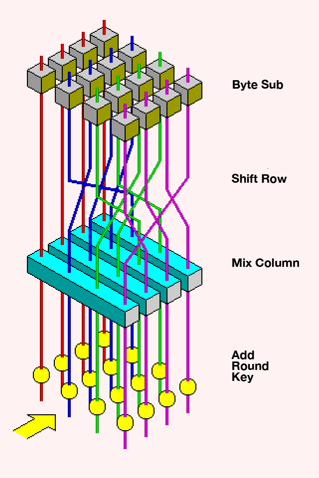
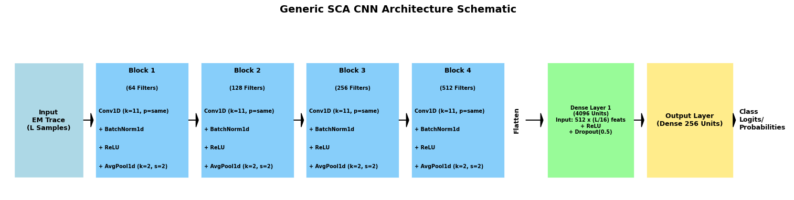
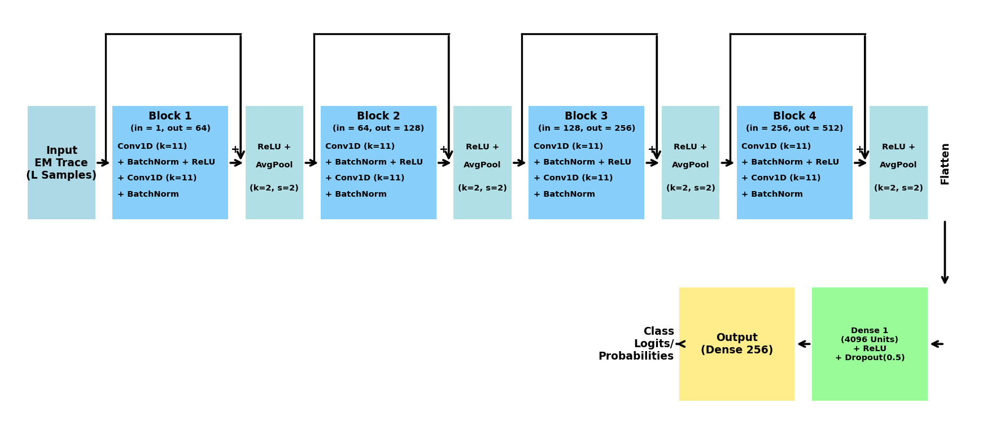

# Machine Learning-Based AES Key Recovery via Side-Channel Analysis

This repository contains overview of implementations of machine learning models for extracting AES encryption keys through electromagnetic (EM) side-channel analysis, using the ASCAD (ANSSI SCA Database) datasets.

Detailed overview and paper at : [arXiv](https://arxiv.org/abs/2508.11817)  and [Project Site](https://mukeshpoudel.com.np/aeskeyrecovery/)

## Overview

While cryptographic algorithms like AES are mathematically secure, their physical implementations can leak sensitive information through side channels such as electromagnetic emissions. This project demonstrates how machine learning techniques can effectively exploit these leakages to recover secret cryptographic keys, confirming the practical vulnerability of AES implementations.



## Datasets

The project uses two ASCAD datasets created by ANSSI:

### 1. ASCADf (Fixed-Key Dataset)
- 50,000 profiling traces and 10,000 attack traces
- Each trace consists of 700 EM measurements
- All traces use the same fixed AES-128 key
- Target: 3rd key byte (index 2)

### 2. ASCADv (Variable-Key Dataset)
- 200,000 profiling traces and 100,000 attack traces
- Each trace consists of 1400 EM measurements
- Different keys used across traces (more realistic scenario)
- Target: 3rd key byte (index 2)

## Code Structure

The repository contains three main Scripts inside the script folder: The scripts are detailed and should be easy to follow. Each script is designed to be run independently, and optimized for hyperparameter study as well and they are organized in a way that allows for a clear understanding of the workflow.

1. **cnn_resnet_unified.py**: CNN and ResNet implementation for fixed-key and variable-key dataset
2. **rd.py**: RF implementation for fixed-key and variable-key 
3. **svc.py**: SVM for fixed-key and variable-key dataset  


### Core Functions

Each notebook includes the following key components:

#### 1. Data Loading and Preprocessing

```python
def load_ascad_dataset(file_path, target_key_byte_idx, load_profiling=True, load_attack=True):
    with h5py.File(file_path, "r") as f:
        if load_profiling:
            profiling_traces = f["Profiling_traces/traces"][:]
            profiling_labels = f["Profiling_traces/labels"][:] 
        
        if load_attack:
            attack_traces = f["Attack_traces/traces"][:]
            _ = f["Attack_traces/labels"][:] 
            attack_plaintexts = f["Attack_traces/metadata"]["plaintext"][:].astype(np.uint8)
            true_key_byte = int(f["Attack_traces/metadata"]["key"][0][target_key_byte_idx])
            
    return profiling_traces, profiling_labels, attack_traces, attack_plaintexts, true_key_byte
```

#### 2. Key Rank Calculation

The key rank metric evaluates how quickly a model can recover the correct key:

```python
def compute_key_rank(model, attack_traces, plaintexts, true_key_value,
                     n_traces_for_rank, sbox_array, target_plaintext_byte_idx,
                     epsilon=1e-12, precomputed_probs=None):
    # Get probabilities from model
    if precomputed_probs is None:
        probabilities = model.predict_proba(attack_traces[:n_traces_for_rank])
    else:
        probabilities = precomputed_probs[:n_traces_for_rank]
    
    # Ensure valid probabilities
    probabilities = np.maximum(probabilities, epsilon)  # Prevent log(0)
    probabilities /= probabilities.sum(axis=1, keepdims=True)
    
    # Calculate log-likelihood for each key guess
    key_log_likelihoods = np.zeros(256)
    for key_guess in range(256):
        # Calculate S-box(plaintext_byte ⊕ key_guess) for all traces
        intermediate_values = sbox_array[plaintexts[:n_traces_for_rank, target_plaintext_byte_idx] ^ key_guess]
        # Get model's probability for each intermediate value
        trace_specific_probabilities = probabilities[np.arange(n_traces_for_rank), intermediate_values]
        # Sum log-probabilities for current key guess
        key_log_likelihoods[key_guess] = np.sum(np.log(trace_specific_probabilities))

    # Rank keys by log-likelihood (descending)
    ranked_key_indices = np.argsort(key_log_likelihoods)[::-1]
    # Find position of true key in ranking
    true_key_rank = np.where(ranked_key_indices == true_key_value)[0][0]
    
    return true_key_rank, key_log_likelihoods
```

This function implements the key recovery algorithm described mathematically as:

$$Score(k_{guess}) = \sum_{i=1}^{N} \log(P(label=Z_{hyp_i} | trace_i) + \varepsilon)$$

Where $Z_{hyp_i} = Sbox(plaintext_i \oplus k_{guess})$ for each trace $i$, and $\varepsilon$ is a small constant to prevent $\log(0)$.

### 3. Machine Learning Models

#### CNN Architecture



Our CNN model processes 1D EM traces through 4 convolutional blocks, each containing:

```python
class SCA_CNN(nn.Module):
    def __init__(self):
        super().__init__()
        self.net = nn.Sequential(
            # Conv block 1
            nn.Conv1d(1, 64, kernel_size=11, padding=5),
            nn.BatchNorm1d(64), nn.ReLU(), nn.AvgPool1d(2),
            # Conv block 2
            nn.Conv1d(64, 128, kernel_size=11, padding=5),
            nn.BatchNorm1d(128), nn.ReLU(), nn.AvgPool1d(2),
            # Conv block 3
            nn.Conv1d(128, 256, kernel_size=11, padding=5),
            nn.BatchNorm1d(256), nn.ReLU(), nn.AvgPool1d(2),
            # Conv block 4
            nn.Conv1d(256, 512, kernel_size=11, padding=5),
            nn.BatchNorm1d(512), nn.ReLU(), nn.AvgPool1d(2),
            # Flatten
            nn.Flatten(),
            # Dense head
            nn.Linear(512 * 43, 4096),
            nn.ReLU(), nn.Dropout(0.5),
            nn.Linear(4096, 256)
        )
    
    def forward(self, x):
        # x: (B, 700) -> (B, 1, 700)
        return self.net(x.unsqueeze(1))
```

Key aspects of the CNN architecture:
- Large kernel size (11) as research shows this improves SCA performance
- Progressively increasing feature maps (64→128→256→512) to capture more complex patterns
- Average pooling to reduce dimensions while preserving important features
- Final dense layers with dropout to prevent overfitting


#### ResNet Architecture



Our ResNet model is built from a series of Residual Blocks. Each block contains a main path with two convolutional layers, and a parallel 'shortcut connection'. This shortcut bypasses the layers and adds the block's original input back to the output of the convolutional path

```python
class ResidualBlock(nn.Module):
    def __init__(self, in_ch, out_ch, ks):
        super().__init__()
        self.conv1 = nn.Conv1d(in_ch, out_ch, ks, padding=ks // 2)
        self.bn1 = nn.BatchNorm1d(out_ch)
        self.relu = nn.ReLU()
        self.conv2 = nn.Conv1d(out_ch, out_ch, ks, padding=ks // 2)
        self.bn2 = nn.BatchNorm1d(out_ch)
        self.shortcut = (
            nn.Conv1d(in_ch, out_ch, 1) if in_ch != out_ch else nn.Identity()
        )

    def forward(self, x):
        res = self.shortcut(x)
        out = self.relu(self.bn1(self.conv1(x)))
        out = self.bn2(self.conv2(out))
        out += res
        return self.relu(out)


class ResNet_SCA_CNN(nn.Module):
    def __init__(self, input_length=700, num_blocks=4, kernel_size=11, filters=None):
        super().__init__()
        if filters is None:
            filters = [64, 128, 256, 512]
        layers = []
        in_channels = 1
        for i in range(num_blocks):
            layers.extend(
                [ResidualBlock(in_channels, filters[i], kernel_size), nn.AvgPool1d(2)]
            )
            in_channels = filters[i]
        self.features = nn.Sequential(*layers)
        dummy_out = self.features(torch.randn(1, 1, input_length))
        self.classifier = nn.Sequential(
            nn.Flatten(),
            nn.Linear(dummy_out.numel(), 4096),
            nn.ReLU(),
            nn.Dropout(0.5),
            nn.Linear(4096, 256),
        )

    def forward(self, x):
        return self.classifier(self.features(x.unsqueeze(1)))


```

Key aspects of the ResNet architecture:
- Each block contains a shortcut connection that adds the input of the block to its output.
- These shortcuts act as "express lanes" for the gradient, mitigating the vanishing gradient problem and allowing the network to be trained to greater depths.
- The improved stability enables the model to learn more complex and abstract features, which are essential for succeeding on noisy and variable-key datasets where the standard CNN failed.

#### Random Forest with Feature Selection

The RF implementation includes feature importance analysis to select the most informative time points:

```python
# Train RF on full features
rf_full = RandomForestClassifier(
    n_estimators=N_ESTIMATORS_RF, 
    max_depth=MAX_DEPTH_RF,
    min_samples_leaf=MIN_SAMPLES_LEAF_RF,
    random_state=RANDOM_STATE,
    n_jobs=-1
)
rf_full.fit(X_profiling_scaled, y_profiling)

# Get feature importances
importances = rf_full.feature_importances_
indices = np.argsort(importances)[::-1]  # Sort in descending order

# Select top features
selected_features = indices[:N_TOP_FEATURES]

# Train RF on reduced features
rf_reduced = RandomForestClassifier(
    n_estimators=N_ESTIMATORS_RF, 
    max_depth=MAX_DEPTH_RF,
    min_samples_leaf=MIN_SAMPLES_LEAF_RF,
    random_state=RANDOM_STATE,
    n_jobs=-1
)
rf_reduced.fit(X_profiling_scaled[:, selected_features], y_profiling)
```

#### Support Vector Classifier with Feature Selection

The SVC model uses the reduced features identified by RF importance analysis:

```python
svc = SVC(
    kernel='rbf',
    probability=True,
    random_state=RANDOM_STATE
)
svc.fit(X_profiling_scaled[:, selected_features], y_profiling)

# Get probability predictions for attack traces
svc_attack_probs = svc.predict_proba(X_attack_scaled[:, selected_features])
```

## Results

Our experimental are detailed in the paper itself

## The Accuracy Paradox in Side-Channel Analysis

A fascinating aspect of this work is that models with extremely low classification accuracy (<2%) can still successfully recover encryption keys. This occurs because:

1. The signal-to-noise ratio in side-channel measurements is inherently low
2. The key rank metric aggregates consistent but subtle patterns across many traces
3. Even small statistical biases toward the correct class become amplified when combined over many traces

This demonstrates why domain-specific evaluation metrics like Key Rank are essential for side-channel analysis.

## Setup and Usage

1. Clone this repository
2. Download the ASCAD datasets:
   ```bash
   wget https://www.data.gouv.fr/s/resources/ascad/20180530-163000/ASCAD_data.zip

   wget https://static.data.gouv.fr/resources/ascad-atmega-8515-variable-key/20190903-083349/ascad-variable.h5
   ```
3. Install required dependencies:
   ```bash
   pip install numpy h5py matplotlib scikit-learn torch
   ```
4. Update the file paths in the notebooks to point to your downloaded datasets
5. Run the notebooks in sequence

## Notes
The code has been modified from the earlier notebooks to better support automated hyperparameter studies. 

The code organization was (at times) assisted through the use of LLMs. 